# **Exploring Demand on Climbing Gyms**

# Table of Contents

1. [Background & Motivaiton](#background-&-motivation)
2. [Validity of Prediction Model](#validity-of-prediction-model)
3. [The Data](#the-data)
4. [Exploratory Data Analysis](#exploratory-data-analysis)
5. [Decomposition](#decomposition)
6. [Hypothesis Testing](#hypothesis-testing)

## **Warning! This repository has been stripped of all numbers of the gym data and only shows trends to protect proprietary information. This repository is only to be used as a tool for evaluation of the repository's owner. It is in no way a source of company information and should not be used for that purpose.**

    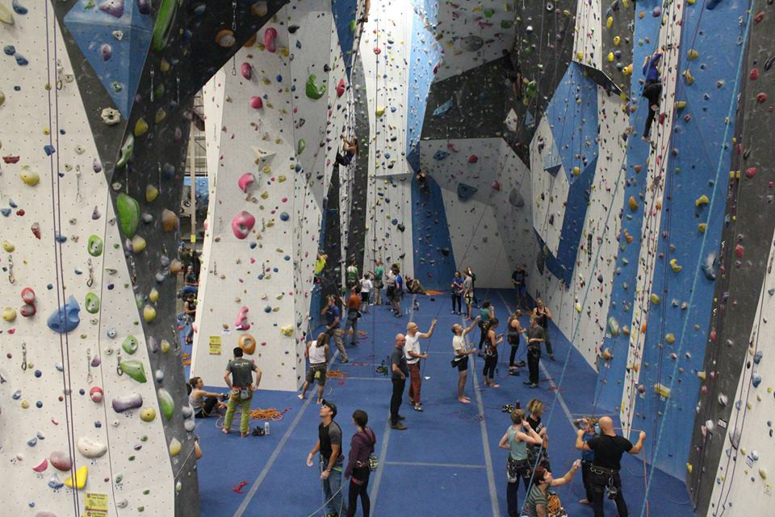</img>

# Background & Motivation
The sport of climbing is growing incredibly fast. Climbing is set to be in the 2020 Olympics for the first time ever and climbing documentaries like The Dawn Wall and Free Solo are getting worldwide attention. Free Solo won an Academy Award only increasing the interest in climbing. This is leading to an increase in demand for climbing gyms. The commercial climbing gym industry has had record growth rates the past 2 years with 10% in 2017 and 12% in 2018. 

In order to better serve the growing demand, it is important to understand when and why people decide to go to a climbing gym. This will allow gym operators to better manage their current gyms and design better ones in the future.

I'm a climber and am currently working in the climbing industry. It is valuable to me to analyze the behavior of fellow climbers and to help inform gym operators how to provide a better experience to gym users. 

# Validity of Prediction Model

    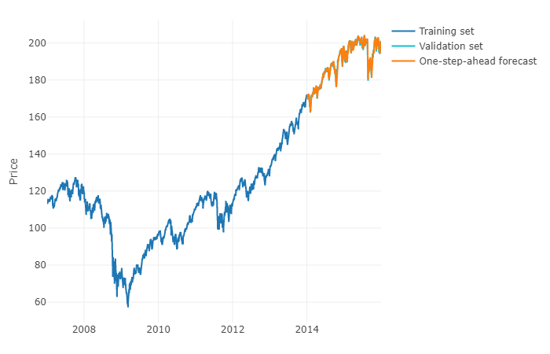</img>

> Note: This is just an example of a time series forecast. This graph was taken from <a href="https://stats.stackexchange.com/questions/346714/forecasting-several-periods-with-machine-learning/346816">StackExchange</a>

From my experience as an employee and member of a climbing gym, I have some ideas about possible correlations between external factors and gym use. I believe that weather has a significant effect on gym use. It seems that days with better weather have less check-ins compared to days with worse weather. If this is true it may be possible to accurately predict the number of people that will check-in to the gym on a given day or hour based on the weather and other trends in gym use.

## Purpose

The purpose of this analysis is to determine the viability of an *hourly check-in prediction model*. The analysis will include a search for features and methods to use in a prediction model. It is important to get a general sense of user behavior and general trends in gym check-ins before comparing them to weather. This will allow for a better analysis of the effect of weather on gym check-ins and may present alternative features to use for the model.

## The Model

A prediction model could be used in 2 main ways: 

- One use of the model is to analyze macro scale effects on gym check-ins. The model could be trained on data over certain time periods with specific external variables. This could then be used to create a *what if* or counterfactual scenario to compare with real world data. For example, the model could be trained on check-in data before the addition of new gyms. This predicted check-in rate can be compared to the actual rate to estimate the effect of new gyms on the demand for a specific gym.

- The model could be used to assist gym operators and managers with gym staffing, event planning, maintenance work, route setting schedules and any other gym functions that are set around gym occupancy.

Limitations of a model that is closely related to weather will be the accuracy and reliability of the weather forecast. In order to make the model more useful it will be necessary to create 2 main parts.

1. A short term prediction of hourly check-ins that will be more accurate and assist in last minute planning and staffing changes.

2. A long term prediction of checkins to assist in setting up staff schedules, event planning, setting schedules, predicting larger trends.

Analyzing counterfactuals will use histroical weather data and will not rely on the accuracy of the forecast.

Details and methods will be determined after an in-depth data analysis and evaluation of available data.

# The Data

To answer these questions and check the validity of such a prediction model I need data on weather and gym check-ins.

    </img>

## Check-in Data

Check-in data was obtained from Earth Treks Climbing and Fitness for gyms in the Denver area. The data was received as a series of .xlsx files with the following format:

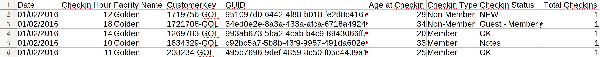</img>

Each row represents a single check-in to the gym. Each column is described below:

|COLUMN|DESCRIPTION|
|---|---|
|`Date`|the date of the check-in.|
|`Checkin Hour`|the specific hour of the check-in.
|`Facility Name`|The name of the gym.
|`Customer Key`|A key associated with the customer that can change over time. The suffix `GOL` is displaying the current users home gym. A home gym is the gym that the person has checked into the most.|
|`GUID`|is the unique id associated with the person checking in.|
|`Age at Checkin`|the age of the person at check-in.|
|`Checkin Type`|Whether the person is a member or not at the time of check-in.|
|`Checkin Status`|Notes on the type of check-in. Most common values: `OK`, `Guest - no membership`, `NEW`, `Notes`, `Guest - Member guest pass`
|`Total Checkins`|either a 1 of 0. Not sure what this column means.|

I received data from two gyms from when each gym opened until December 11, 2019.

- Golden gym: XXX check-ins from November 22, 2013 - December 11, 2019
- Englewood gym: XXX check-ins from August 30, 2018 - December 11, 2019

Older gyms had multiple .xlsx files spanning multiple years. Below is an example of the raw data folder:

    - data/raw/    
        'Englewood Check Ins 2018-121319.xlsx'  
        'Golden Check Ins 2013-2015.xlsx'  
        'Golden Check Ins 2016-2017.xlsx'  
        'Golden Check Ins 2018-121119.xlsx'

## Weather Data

    </img>

In order to compare the gym check-in data with the weather, I need to have historical data for the area around the gyms that has been recorded hourly. There is a National Renewable Energy Laboratory (NREL) Solar Radiation Research Laboratory (SRRL) in Golden. The facility has been collecting and storing hourly weather data since 1981. This data is all available online which can be downloaded as csv files. The station is about 2 miles from the Golden gym and about 11 miles from the Englewood gym. Most of the sensors that are available are for solar data but there is a multitude of sensors that are specifically weather that seems pertinent to whether a person would decide to go to the gym.

The columns of the raw data are:  

|COLUMN|DESCRIPTION|
|---|---|
|`DATE (MM/DD/YYYY)`|The day of the observation in MST|
|`HOUR-MST`|The hour of the observation in MST|
|`Avg Deck Dry Bulb Temp [deg C]`|The average hourly dry bulb temperature taken at the deck (near the ground) in degrees Celsius|
|`Avg Total Cloud Cover [%]`|The average hourly cloud cover including semi-transparent clouds|
|`Avg Opaque Cloud Cover [%]`|The average hourly cloud cover of only opaque clouds|
|`Avg Avg Wind Speed @ 6ft [m/s]`|The average hourly wind speed taken at 6ft in m/s|
|`Avg Avg Wind Speed @ 19ft [m/s]`|The average hourly wind speed taken at 19ft in m/s|
|`Avg Precipitation [mm]`|The average hourly precipitation in mm|
|`Avg Snow Depth [cm]`|The average snow depth in cm|

## Data Pipeline

We may want to include new gyms in our analysis/model in the future. In order to allow for scaleability, it was beneficial to set up a data pipeline that takes in data from a series of raw .xlsx files and builds an organized and cleaned PostgreSQL database.

Below is a visual representation of the data pipeline:

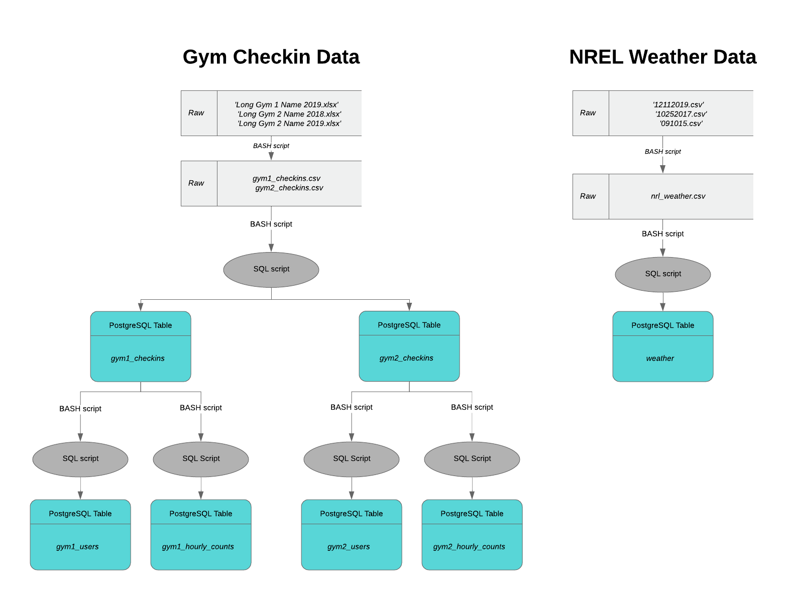</img>

All the data is cleaned in the SQL scripts. There were a few noteworthy cleaning steps:

### Duplicate Check-ins

Throughout the data there were duplicate check-ins. Either a person checked in twice within the same hour or the system registered their check-in twice. There were also check-ins from the same person on the same day. This could mean that they checked in, left, and came back later. Counting both check-ins is reasonable when they are a significant time apart i.e. 6 am and 5 pm. But there were check-ins that were only a few hours apart. It is unlikely that a person checked in, used the gym, left, came back and checked back in within this short time frame. Therefore I only kept the first check-in for a given person  that checked in multiple times within 4 hours using a SQL CROSS JOIN.

| GUID                                 | Date       |   Checkin Hour |
|:-------------------------------------|:-----------|---------------:|
| f4771ea1-3990-4897-8f7c-f4d849b3c501 | 11/22/2013 |             11 |
| f4771ea1-3990-4897-8f7c-f4d849b3c501 | 11/22/2013 |             12 |
| 559e4eae-3e3e-4735-b5b5-2997ff26f4a8 | 11/22/2013 |             11 |
| 559e4eae-3e3e-4735-b5b5-2997ff26f4a8 | 11/22/2013 |             11 |
| 559e4eae-3e3e-4735-b5b5-2997ff26f4a8 | 11/22/2013 |             11 |

### Hours of Operation

It is important to accurately portray hours that no one checks in. Aggregating the check-in data by hour leaves these hours out and resampling the entire dataset by hour includes 0s when the gym is closed.

In order to get proper values when aggregating, it is important to only include hours that the gym is open. This was done in SQL by creating a temporary table with columns `date` and `hour` that the gym is open and joinning the hourly check-in counts to it.

I only include days that the `tot_checkins > 50` in order to account for days the gym is closed like Christmas or Thanksgiving.

### Weather

Cleaning the weather data required some unit conversion, null value replacement and interpolation due to the way the data is recorded and erratic sensor behavior. Most notably, the snow depth data had some difficult to detect spikes that required analyzing the difference of the time series data. A more step by step process can be seen in the [cleaning.ipynb](cleaning.ipynb).

# Exploratory Data Analysis

The first step is to plot the aggregated data to get the big picture. I resampled the hourly aggregated data into weekly check-ins to create a plot of the total number of check-ins per week over time.

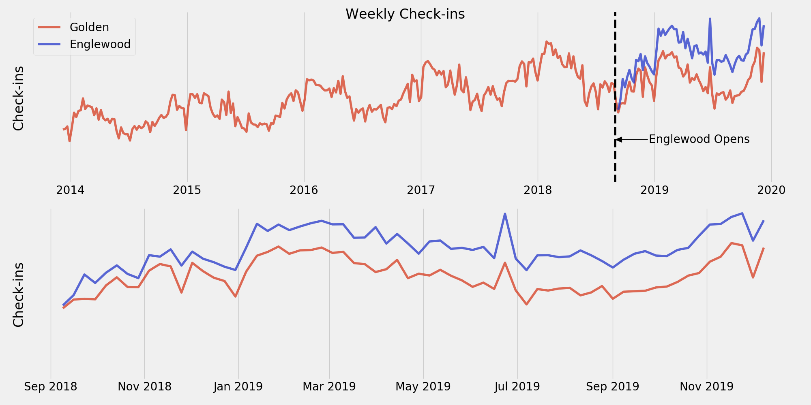</img>

> Note: This is an aggregated sum of *check-ins per week*. This gives a good sense how many total people are coming into the gym. Weeks with less hours open will have lower overall counts i.e. Christmas.

There appears to be a strong seasonality component to gym check-ins with low numbers in the summer and high numbers in the winter. To further explore this I plotted check-ins by month.

<table>
    <tr>
        <td>
            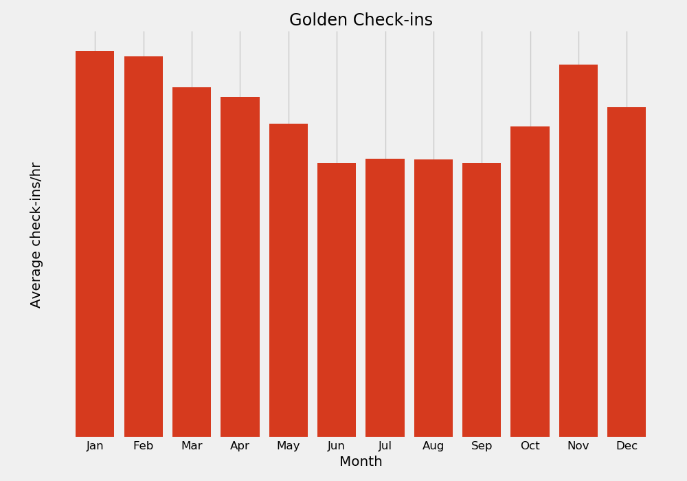</img>
        </td>
        <td>
            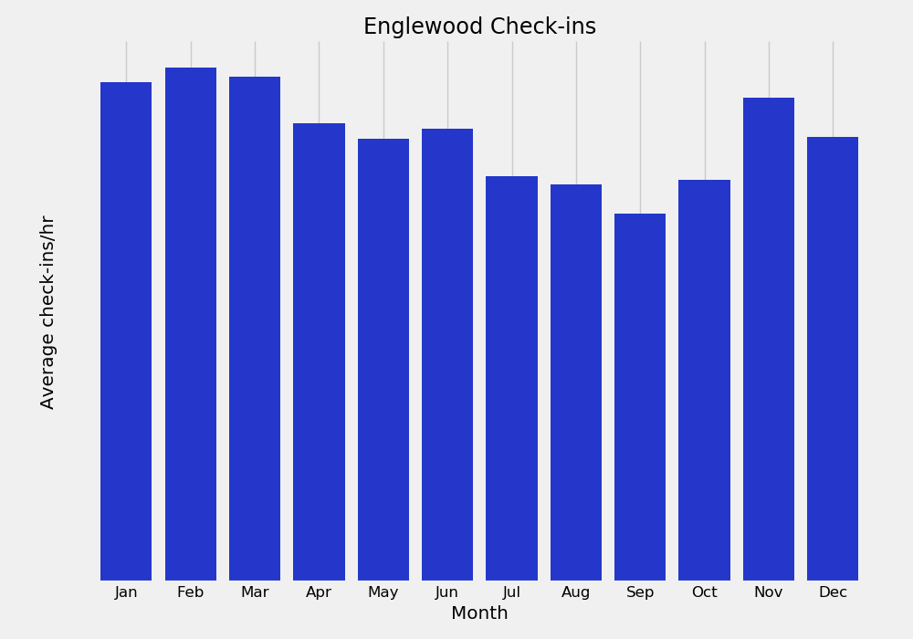</img>
        </td>
    </tr>
</table>

> Note: This is an *hourly average* of check-ins per month. This gives a sense of the rate of people coming into the gym.

Now we have an overall sense of the data over longer periods of time. It's also necessary to look at the distribution of check-ins over a given day. This will allow us to compare similar days in order to see the effect of weather on check-ins.

<table>
    <tr>
        <td>
            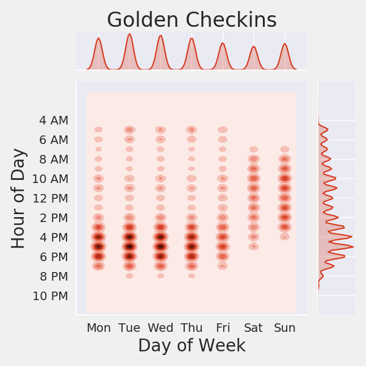</img>
        </td>
        <td>
            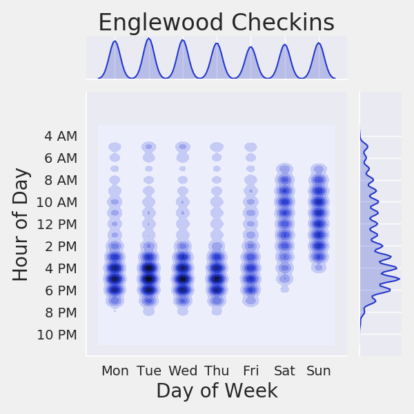</img>
        </td>
    </tr>
</table>

Unsurprisingly, its clear that weekends and weekdays have very different check-in distributions. The weekdays are more concentrated after work and the weekends are more spread out throughout the day. It appears that Friday does not fit into either category particularly well and has a distribution somewhere between the Monday - Thursday group and the Saturday, Sunday group.

# Decomposition

The next step is to decompose the data into *trend* and *seasonality* components. This will allow us to to compare the effect of weather on a day in 2019 to one in 2014 by removing the year over year trend to evaluate the relative daily check-ins.

I used several methods to estimate the *trend* component of the data. The two methods that proved to be the best were a simple **linear fit** and an **annual average**. The results of the two methods are below.

<table>
    <tr>
        <td>
            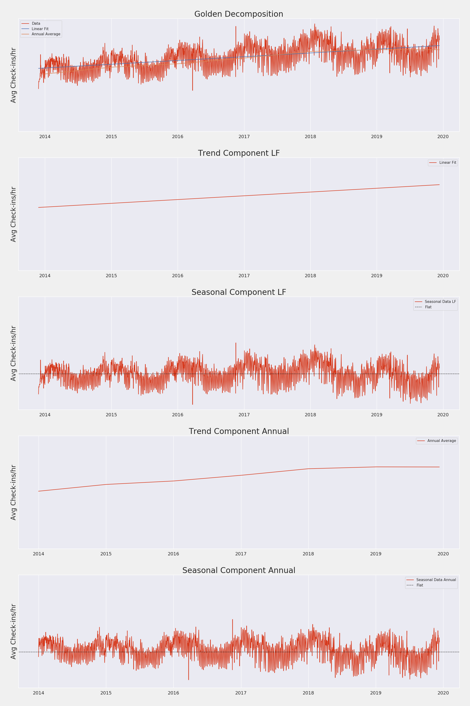</img>
        </td>
        <td>
            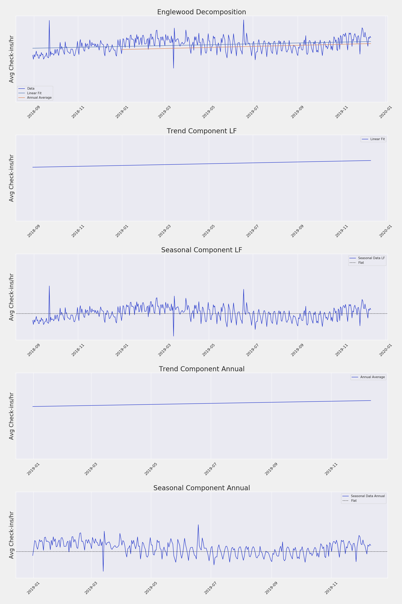</img>
        </td>
    </tr>
</table>

While the results are similar I think the **annual average** method captures the trend of Golden well while a simple **linear fit** seems appropriate for Englwood.

The **annual average** captures the leveling off of check-ins at Golden when the Englewood gym opens. This leveling off is clearly shown in the *trend* component of the **annual average** after 2018 in the Golden decomposition graph.

# Hypothesis Testing

## Hypotheses

From my domain knowledge as a user and employee of climbing gyms, I think that the weather has a strong correlation on climbing gym use. I have set up a few specific hypotheses that I would like to test.

1. A high temperature for the day between 50°F and 90°F will *decrease* gym use
2. Any amount of precipitation will *increase* gym use
3. Any amount of snow will *increase* gym use

These questions are set up in a way to provide 2 specific groups. Days that have bad weather and days that have good weather. This will give me two distributions to perform a hypothesis test. 

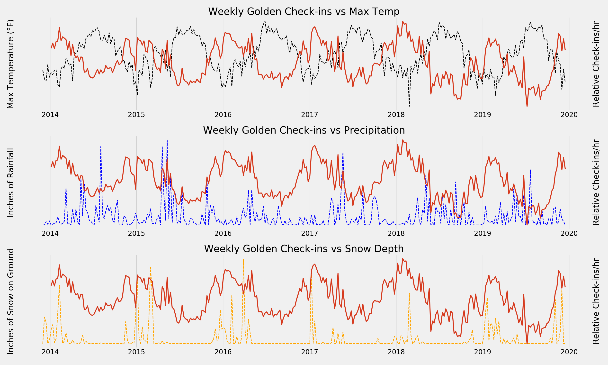</img>
> Note: The Y axis on the right is relative check-ins. The check-in data (red line) is the *seasonal* component of the check-in data and does not relate to actual check-in numbers.

A quick glance at the Golden check-in data against the above weather parameters shows a strong correlation with temperature and possible correlations with precipitation and snow depth. Although the graphs appear to show correlations it is still necessary to perform a more rigorous test to ensure there is a significant difference between the good weather days and bad weather days distributions.

## Hypothesis Tests

We will have a more rigourous statistical test and a better chance of finding the true effect of weather if we compare similar groups. From the EDA above I have determined the groups below:

1. Compare Monday - Thurday
2. Compare weekends

I am interested in whether the check-ins are higher or lower so a two-tailed T-test is appropriate for this situation. Each distribution is a series of daily check-ins. I feel comfortable assuming that these are independent and identically distributed because they are taken from a fairly large sample of days among similar groups. Performing these 6 tests for each gym will total in 12 hypothesis tests. A conservative correction for the number of tests is the Bonferoni correction. In order to reject the null hypothesis the p-value will need to be less than the corrected value below:

Single test significance level:
α = 0.05

Bonferoni corrected significance level:
α = 0.05 / 12 = 4.16E-3

## Results

Below are the distributions from the Golden gym for days that the max temperature was *good* compared with the distributions that the temperature was *bad*. Area under the curve to the right indicates more days with more check-ins while area the left indicates more days with less check-ins. 

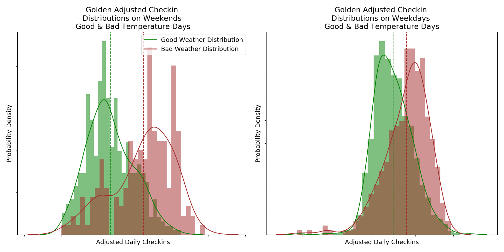</img>

### Golden Hypothesis Test Results
|Bad weather condition | Weekends                                               | Weekdays                              |
|:-----:|:-------------------------------------------------------:|:------------------------------------------------------:|
| Max Temp < 50 OR Max Temp > 90 | XXX more checkins on bad weather days with a p value: < 0.001 | XXX more checkins on bad weather days with a p value: < 0.001 |
| Rain | XXX more checkins on bad weather days with a p value: 0.001  | XXX more checkins on bad weather days with a p value: < 0.001 |
| Snow on ground | XXX more checkins on bad weather days with a p value: < 0.001 | XXX more checkins on bad weather days with a p value: < 0.001 |

### Englewood Hypothesis Test Results
|Bad Weather Condition | Weekends                                               | Weekdays                              |
|:-----:|:-------------------------------------------------------:|:------------------------------------------------------:|
| Max Temp < 50 OR Max Temp > 90 | XXX more checkins on bad weather days with a p value: < 0.001 | XXX more checkins on bad weather days with a p value: 0.009 |
| Rain | XXX more checkins on bad weather days with a p value: 0.132  | XXX more checkins on bad weather days with a p value: 0.066 |
| Snow on ground | XXX more checkins on bad weather days with a p value: < 0.001 | XXX more checkins on bad weather days with a p value: < 0.001 |

## Findings

Looking at the results above shows that gym check-ins are affected by the weather. Most notably the temperature. On average XXX more people check-in to the Golden gym and XXX more people into the Englewood gym on the weekends when the weather outside is extreme. The effects from weather are larger on the weekends than on weekdays. This is most likely due to people choosing to be outside on a nice weekend than in the gym.

The effect from snow depth seems to be the most significant. But I am concerned that this may be the effect of snow depth combined with the effects from temperature. It only snows when the temperature is low and less people check into the gym when it is cold. This means the features are dependent and the effects should be adjusted for.

# Future Work

## Statistical Analysis

More analysis should be done to investigate these findings with more detail and rigor. It may be interesting to control for more factors than just day of week. I would like to look for the effect of weather while controlling or adjusting for:

- Temperature for analyzing the effect of snow
- Holidays for all weather conditions

## Daily Distribution Analysis

Its clear from above that different days of the week have different daily distributions. It may be useful to analyze the daily distributions more deeply in order to predict a daily distribution for a given day. This could be used with a daily check-in prediction to estimate a daily distribution.

## Catergorizing Users

I did not have time to dive into the user tables that were created from the raw gym check-in data. It would be really interesting to find ways to catergorize users and predict their behavior. This could also lead to better estimates of required staff and space required for a specific type of user.

